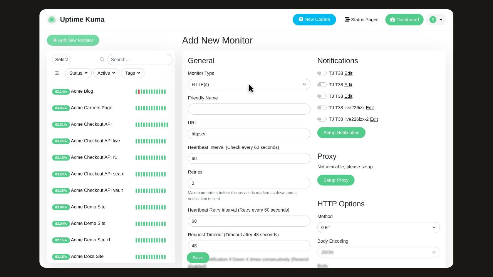
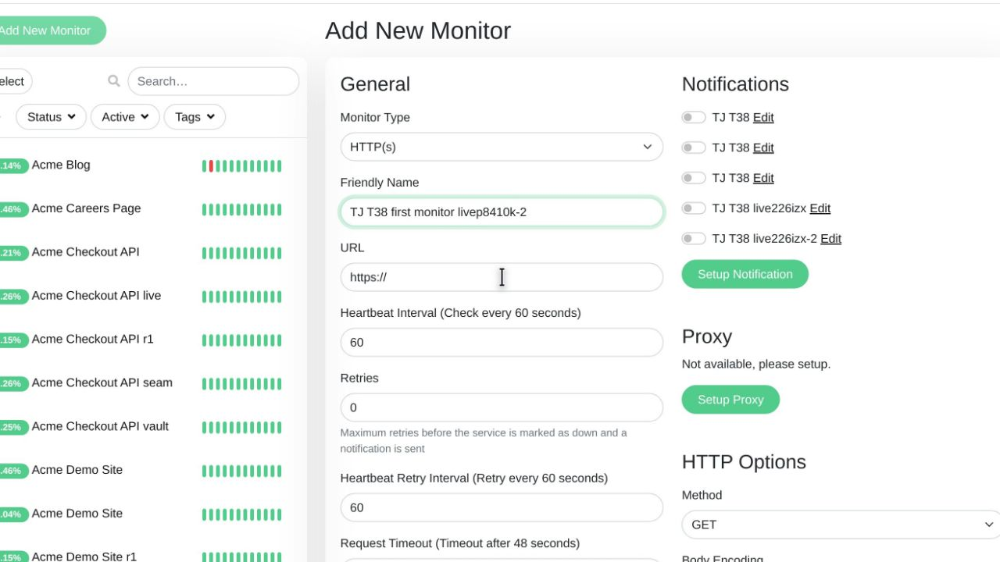
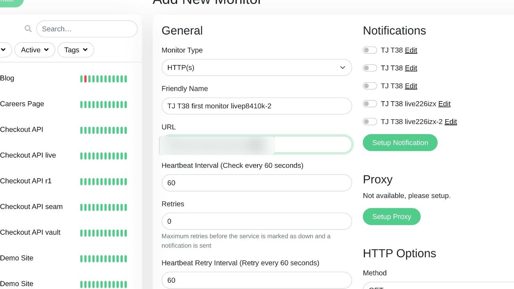
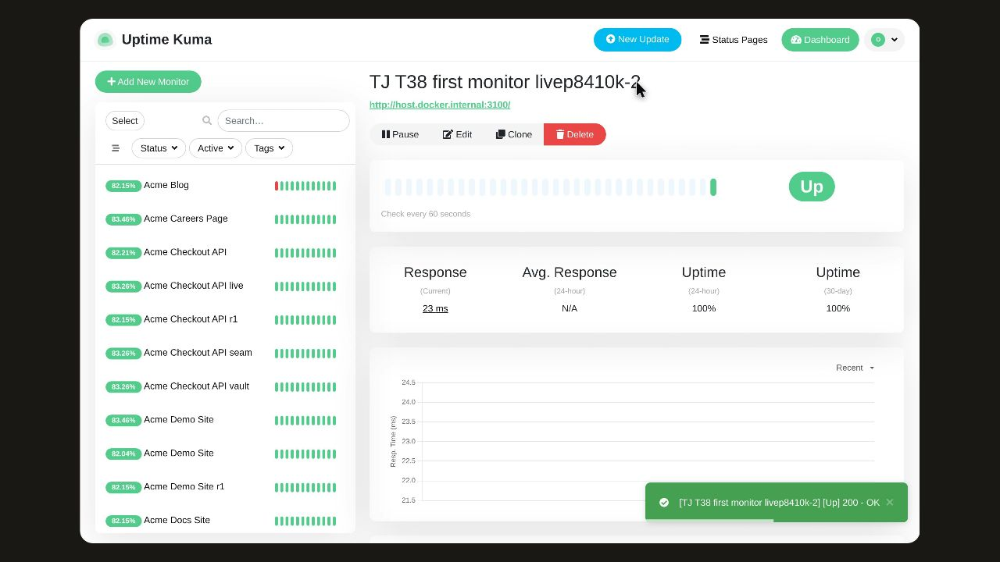
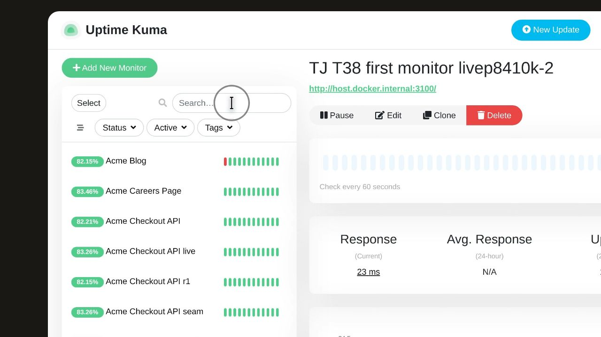
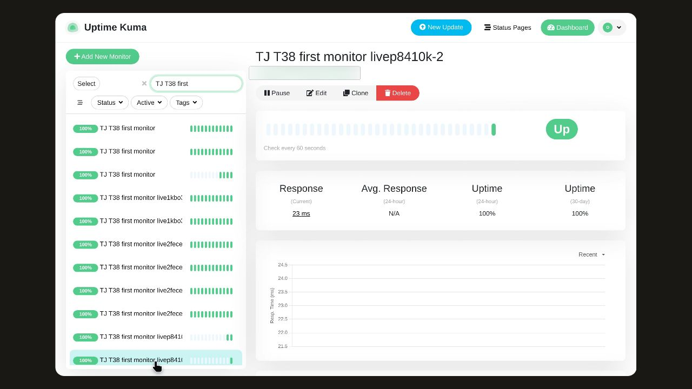

# Add your first monitor

Add your first HTTP(s) monitor in Uptime Kuma, then confirm it appears in the monitored sites list.

## Before you start

Open the Add New Monitor form at /add.

## Step 1: In the monitor type list, choose HTTP(s), which is the default check type.

## Step 2: In the Friendly Name field, enter a name for your monitor, such as "TJ T38 first monitor livep8410k-2".

## Step 3: In the URL field, enter the address you want watched, such as "http://host.docker.internal:3100".

## Step 4: Click Save to create the monitor.

## Step 5: Click the Search monitored sites box in the sidebar.

## Step 6: Type part of the monitor name, such as "TJ T38 first", to filter the list to your new monitor.

## Observed result

After Save, the new monitor named "TJ T38 first monitor" appears.

## About this page

Written from a completed recording. The instructions describe recorded actions and visible results.

## Related pages

Find your way around Uptime Kuma

Pause a Monitor in Uptime Kuma
