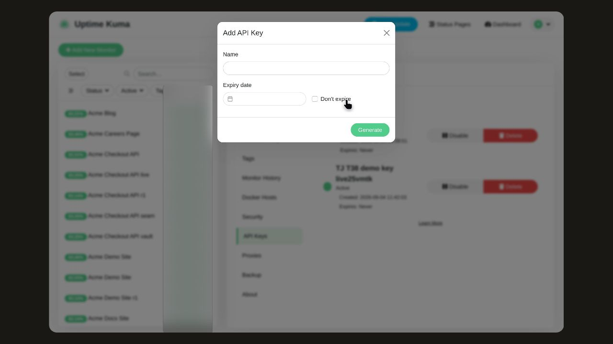
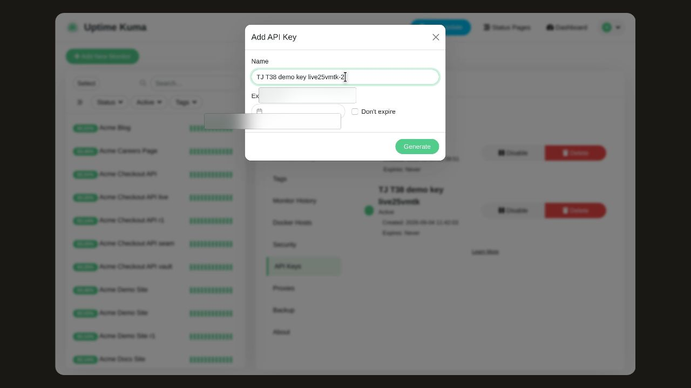
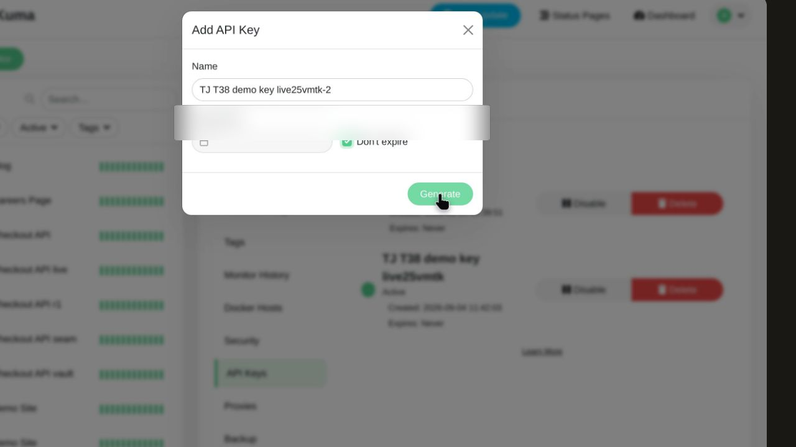
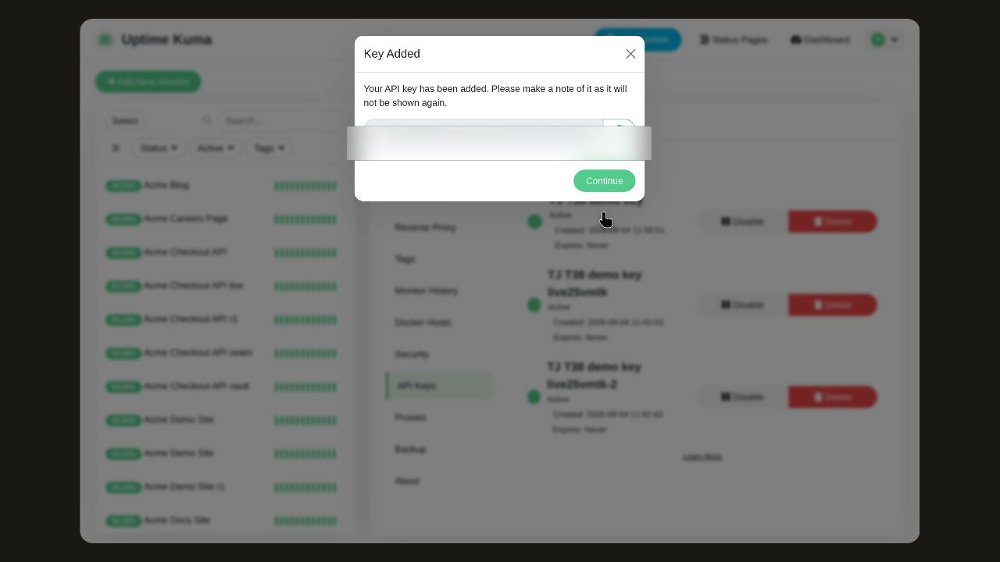
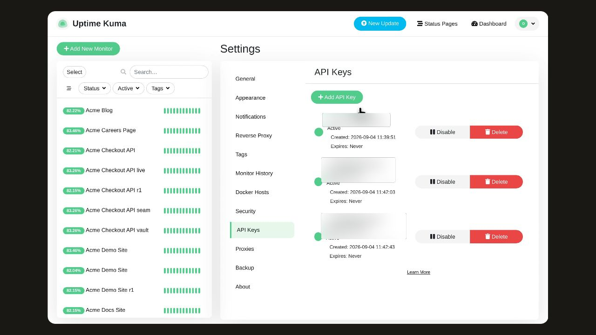

# Create an API key

Create a new API key so it appears in the API Keys list ready to use.

## Before you start

Open the settings area and go to the API Keys tab at /settings/api-keys, which lists each key with its status, creation date, and expiry.

## Step 1: On the API Keys tab, click Add API Key to open the dialog that asks what to call the key and how long it lasts.

## Step 2: Click the Name field and type a name for the key, such as "TJ T38 demo key live25vmtk-2".

## Step 3: Tick Don't expire so the expiry date field grays out and the key does not expire.

## Step 4: Click Generate to create the key.

## Step 5: On the Key Added confirmation, click Continue to close it.

## Observed result

The new key named TJ T38 demo key appears in the API Keys list.

## About this page

Written from a completed recording. The instructions describe recorded actions and visible results.
