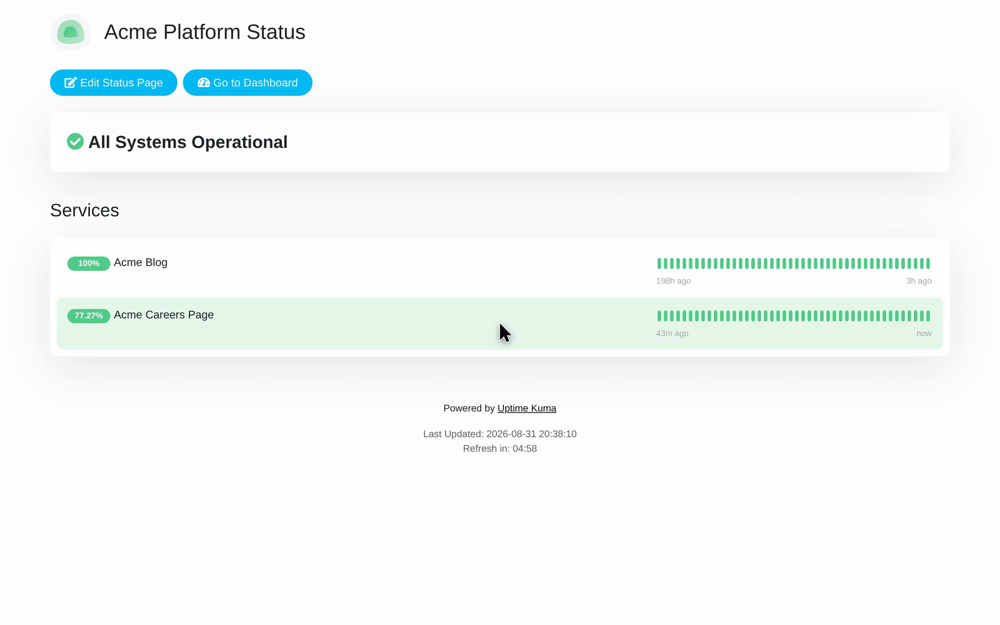

# Explore Status Page Details in Acme

Follow the recorded steps for Explore Status Page Details in Acme.

## Before you start

Start at /manage-status-page.

## Step 1: Look for Status Pages.

Look for Status Pages.

## Step 2: Click Acme Platform Status.

Click Acme Platform Status.

## Step 3: Look for Services.

Look for Services.

## Step 4: Look for Acme Careers Page.

Look for Acme Careers Page.

## Observed result

The page shows "Acme Careers Page".

## About this page

Written from a completed recording. The instructions describe recorded actions and visible results.
