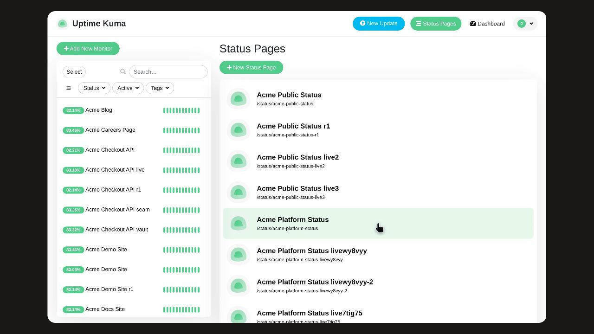
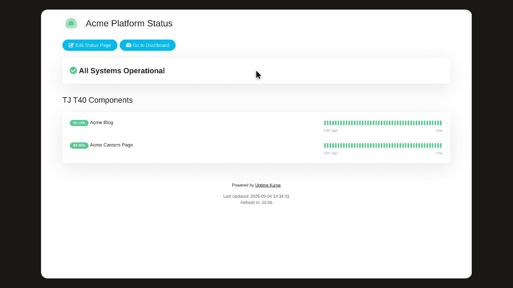
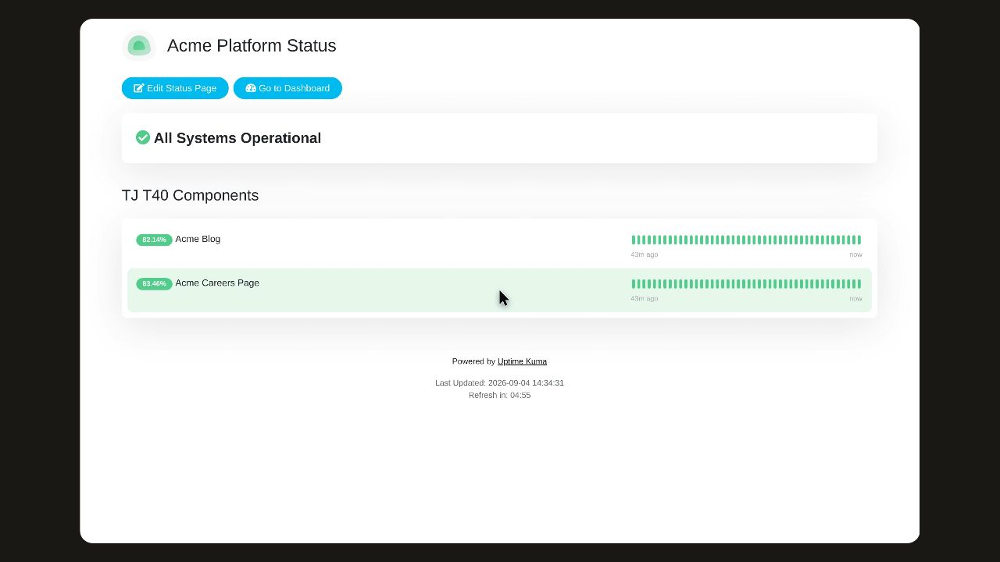

# Explore Status Page Details in Acme

Follow the recorded steps for Explore Status Page Details in Acme.

## Before you start

Start at /manage-status-page.

## Step 1: Look for Status Pages.

Look for Status Pages.

## Step 2: Click Acme Platform Status/status/acme-platform-status.

Click Acme Platform Status/status/acme-platform-status.

## Step 3: Click TJ T40 Components.

Click TJ T40 Components.

## Observed result

A result beyond the recorded actions has not been observed.

## About this page

Written from a completed recording. The instructions describe recorded actions and visible results.
