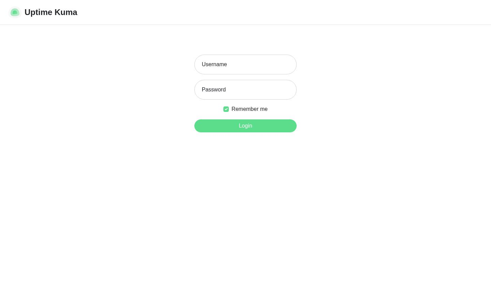
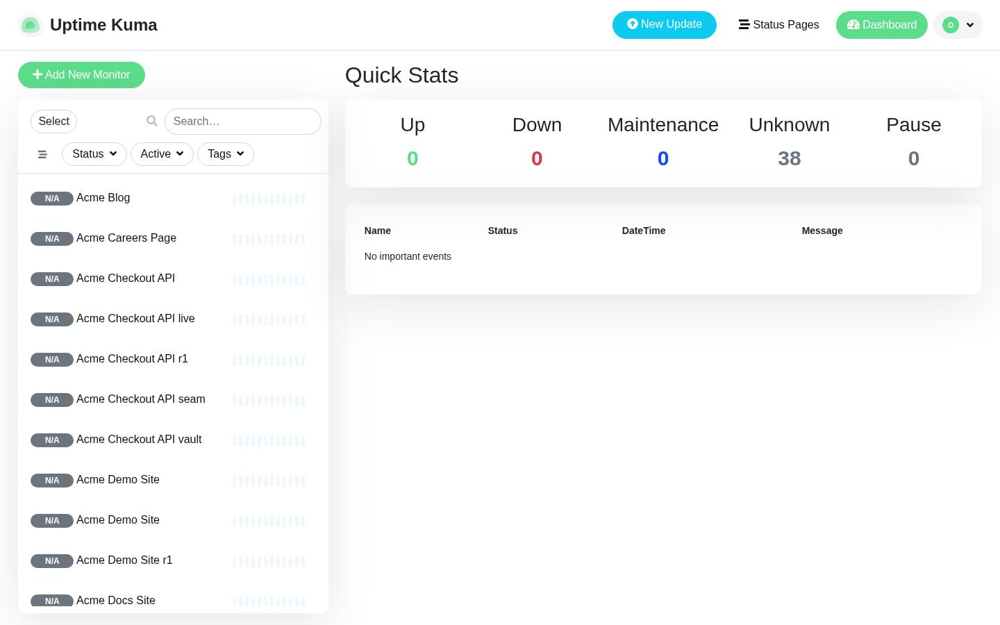
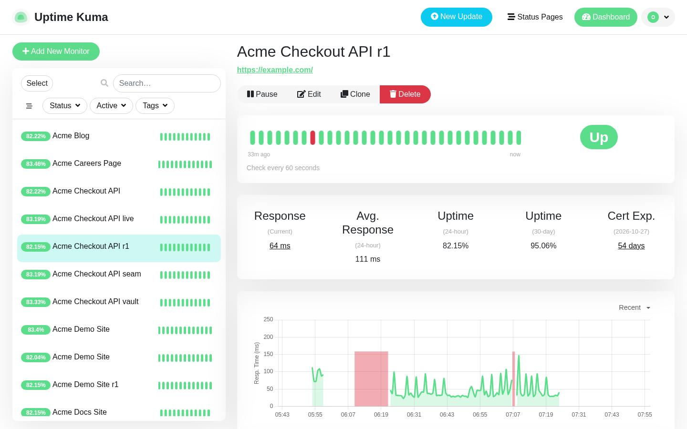
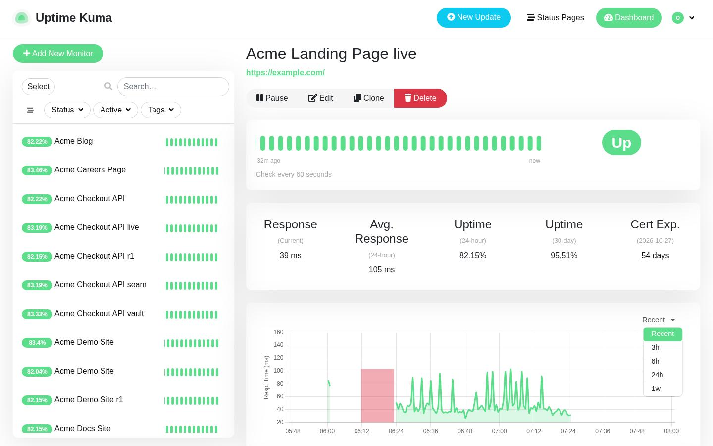
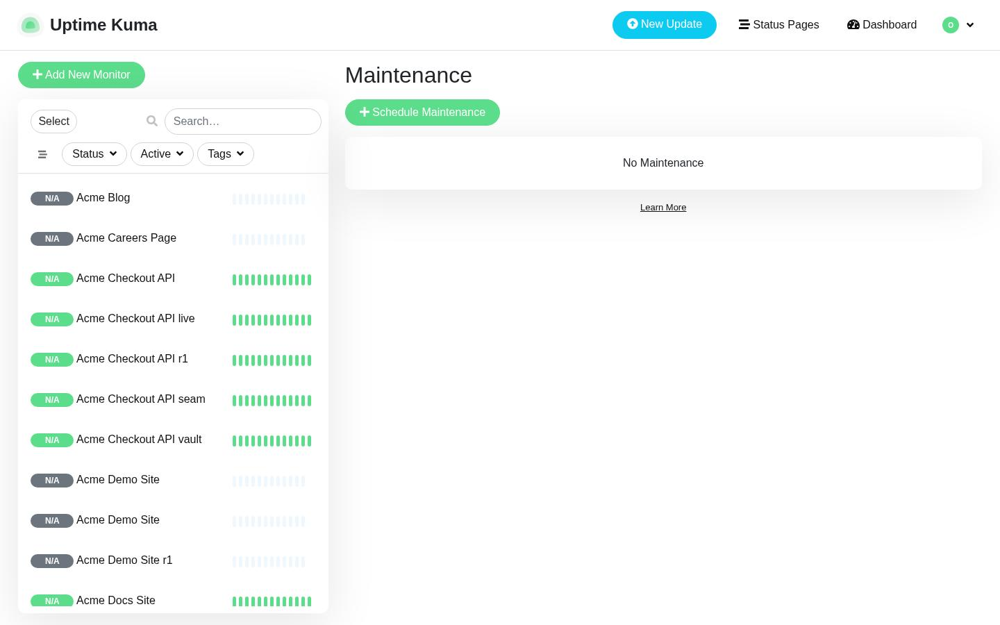
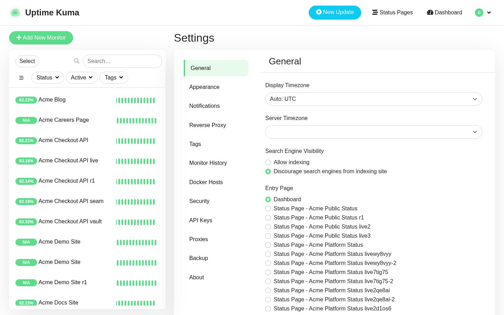
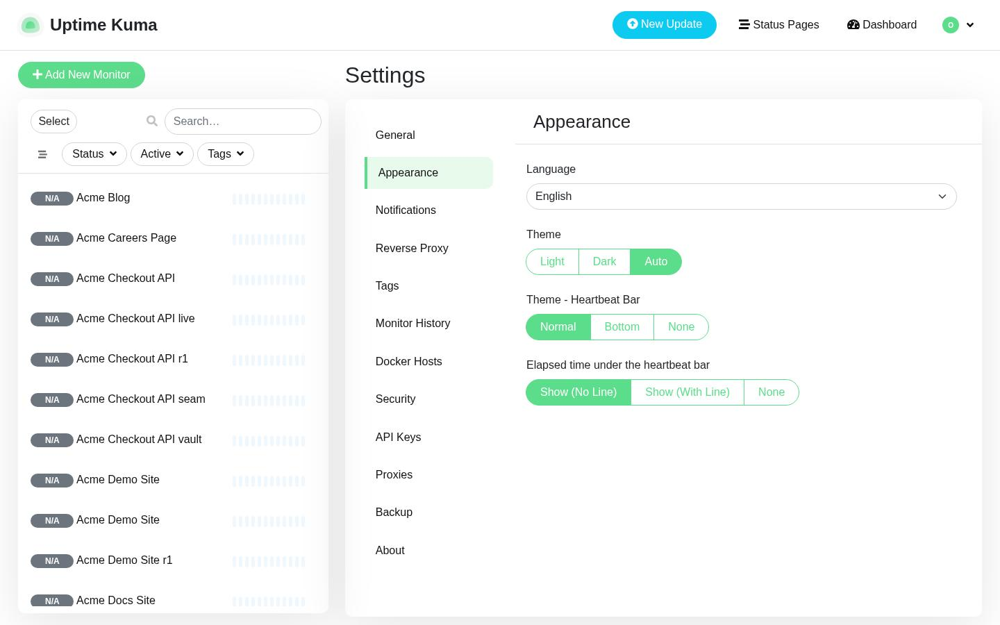
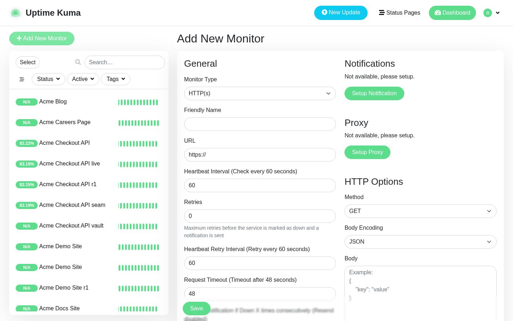
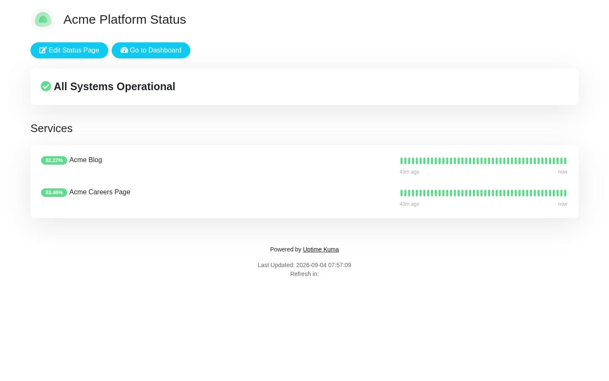

# Find your way around Uptime Kuma

Uptime Kuma lets you monitor your sites and services, review their recent status, publish public status pages, schedule maintenance, and manage application settings. This orientation walks a new reader from signing in through the dashboard to the main areas: individual monitors, status pages, maintenance, settings, adding a monitor, and reading a published status page.

## Sign in

The Sign in screen at /dashboard is where you enter your credentials. It shows the Uptime Kuma heading and a Login control, along with Username, Password, and Remember me fields.

## Quick Stats

The Quick Stats dashboard at /dashboard is the main landing area. It lists the monitored Acme sites with their status, along with a search box for monitored sites, an Add New Monitor control, a Status Pages link, and an events area showing Name, DateTime, and Message columns. An O control is also present.

## Quick Stats

Opening the O menu from the dashboard reveals the account and navigation options: Maintenance, Settings, Help, and Logout. From here you can reach Maintenance and Settings. The monitor list, search box, and events area remain visible behind the menu.

## Acme Checkout API r1

The Acme Checkout API r1 monitor detail page at /dashboard/3 shows the monitored URL (https://example.com/) and controls to Pause, Edit, Clone, and Delete the monitor. It includes Recent and Clear Data sections and a response time reading. The events area shows no important events for this monitor.

## Acme Landing Page live

The Acme Landing Page live monitor detail page at /dashboard/16 shows the monitored URL and controls to Pause, Edit, Clone, and Delete, along with Recent and Clear Data sections and a response time reading.

## Acme Landing Page live

With the Recent section open on Acme Landing Page live, time-range controls (3h, 6h, 24h, 1w) appear alongside the monitor's Pause, Edit, Clone, and Delete controls. The events area records the monitor coming Up. This is where you can pause and resume the monitor.

## Status Pages

The Status Pages screen at /manage-status-page lists the existing status pages and provides a New Status Page control for creating another. The monitor list and search box remain in the surrounding layout.

## Maintenance

The Maintenance screen at /maintenance offers a Schedule Maintenance control and a Learn More link for planning maintenance windows.

## Settings

The Settings screen at /settings/general is the configuration hub, with a side list of sections: General, Appearance, Notifications, Reverse Proxy, Tags, Monitor History, Docker Hosts, Security, API Keys, Proxies, Backup, and About. The general options include Display Timezone, indexing controls, and status page entries, with Save and Test controls.

## Settings

The Appearance settings screen at /settings/appearance provides a Language selector and theme options including Light, Dark, and Auto, plus display choices. This is where you switch the interface theme to dark.

## Add New Monitor

The Add New Monitor screen at /add is where you create a monitor. It provides fields for Monitor Type, Friendly Name, URL, Heartbeat Interval, Retries, Request Timeout, and more, along with Setup Notification, Setup Proxy, and Save controls.

## Acme Platform Status

The Acme Platform Status page at /status/acme-platform-status is a published status page. It shows the Uptime Kuma heading with an Edit Status Page control and a Go to Dashboard link.

## Navigation

From the Quick Stats dashboard, open the O control to reveal the account menu with Maintenance and Settings.

From the Quick Stats dashboard, open Status Pages to reach the Status Pages screen.

From the dashboard's open O menu, open Maintenance to reach the Maintenance screen.

From the dashboard's open O menu, open Settings to reach the Settings screen.

From the Settings screen, open Appearance to reach the Appearance settings.

From the Quick Stats dashboard, open the Acme Checkout API r1 entry to reach its monitor detail page.

From the Quick Stats dashboard, open the Acme Landing Page live entry to reach its monitor detail page.

From the Acme Landing Page live monitor page, open Recent to show the recent time-range view.

## Main tasks

Sign in on the Sign in screen (/dashboard) using the Username and Password fields.

Open a monitor from the dashboard list on Quick Stats (/dashboard).

Create an HTTP monitor on the Add New Monitor screen (/add).

Create a status page on the Status Pages screen (/manage-status-page).

Browse the Status Pages list and open a page on the Status Pages screen (/manage-status-page).

Schedule maintenance on the Maintenance screen (/maintenance).

Configure general settings on the Settings screen (/settings/general).

Switch the interface theme to dark on the Appearance settings screen (/settings/appearance).

Pause and resume a monitor on the Acme Landing Page live monitor page (/dashboard/16).

Read a published status page on Acme Platform Status (/status/acme-platform-status).

## About this page

Written from the product's screens; no demo yet

## Related pages

Switch to dark theme

Pause a Monitor in Uptime Kuma

Explore Status Page Details in Acme
