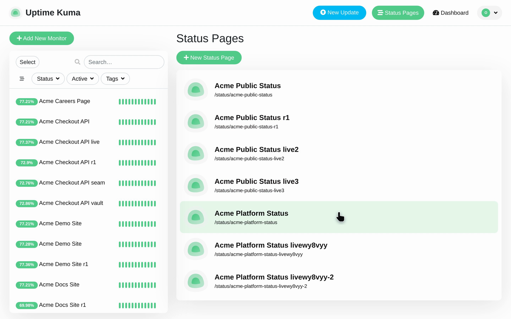
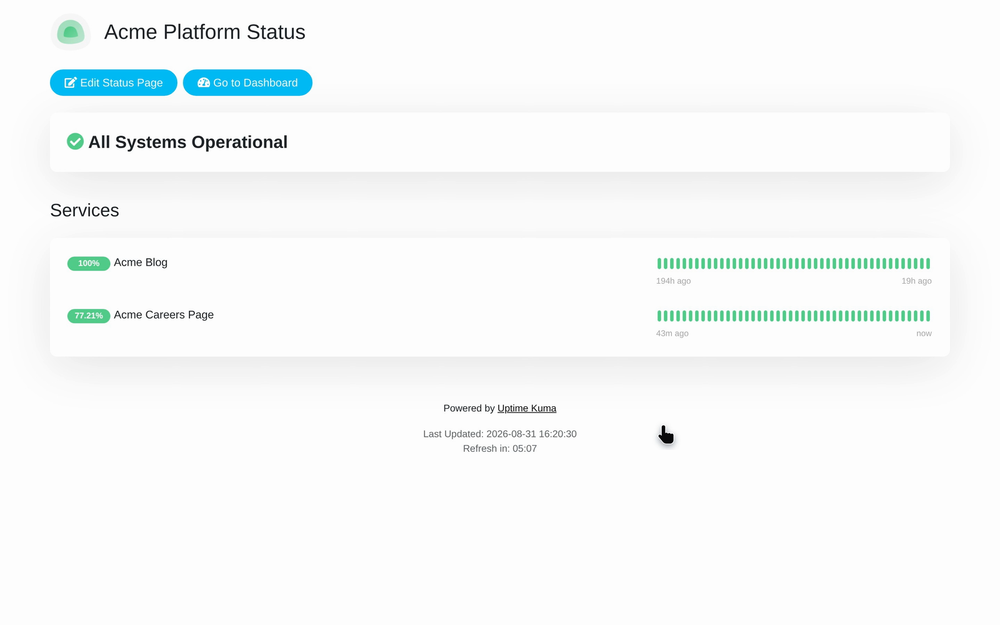
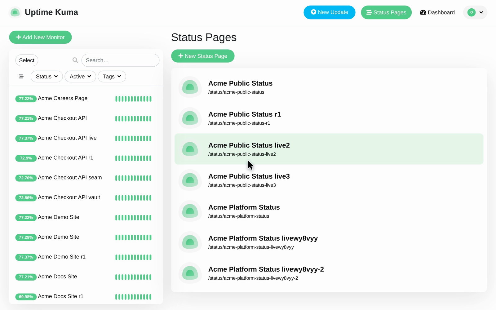

# View a Public Status Page and Its Services

Use this walkthrough to open the Acme Platform Status public status page, review the services published in its **Services**, and return to the Status Pages.

## Step 1: Open Acme Platform Status

Click the **Acme Platform Status** entry. Confirm that its public status page opens and shows the overall system status.

Open `/manage-status-page`. Confirm that the page lists the status pages you have created and shows each page’s public address.

## Step 2: Review the Services section

Move down to the **Services** section, where **Acme Blog** is listed.

Confirm that the page has one group named Services and that Acme Blog is listed first.

Confirm **Services** lists **Acme Blog** first, followed by **Acme Careers Page**.

## Step 3: Return to the Status Pages

Go back to `/manage-status-page`. Confirm that the full list of status pages is displayed again so you can open another page.

You end back on `/manage-status-page` at the full list of status pages, ready to open another page.
