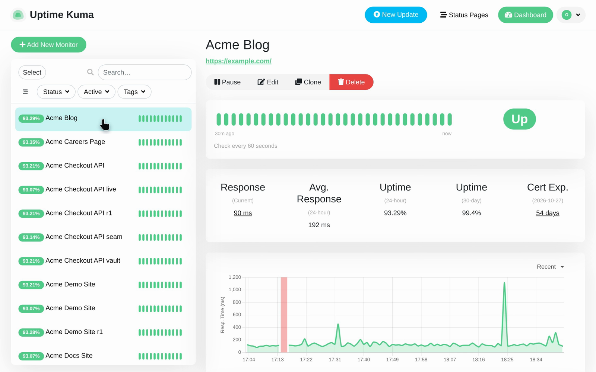
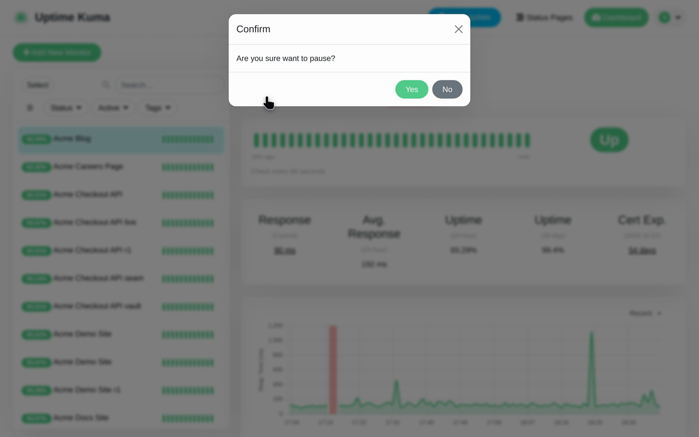
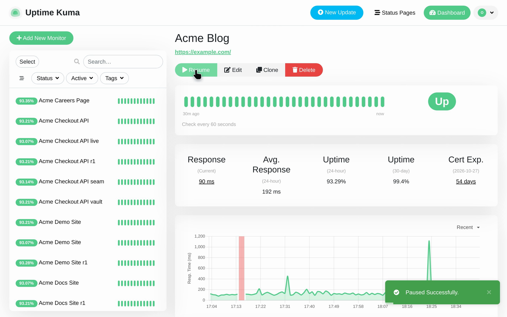

# Pause a Monitor in Uptime Kuma

Follow the recorded steps for Pause a Monitor in Uptime Kuma.

## Before you start

Start at /dashboard.

## Step 1: Click Acme Blog.

Click Acme Blog.

## Step 2: Click Pause.

Click Pause.

## Step 3: Click Yes.

Click Yes.

## Observed result

The page shows "Resume".

## About this page

Written from a completed recording. The instructions describe recorded actions and visible results.
