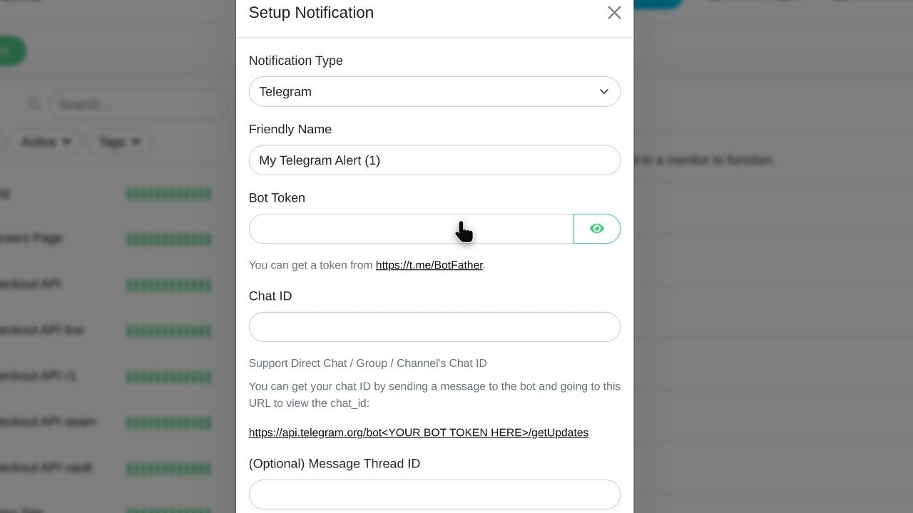
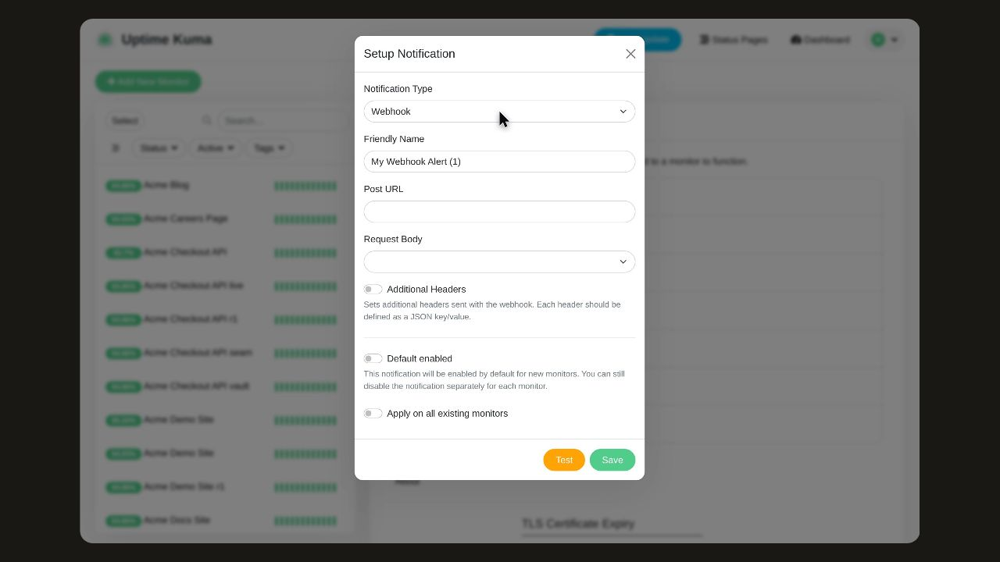
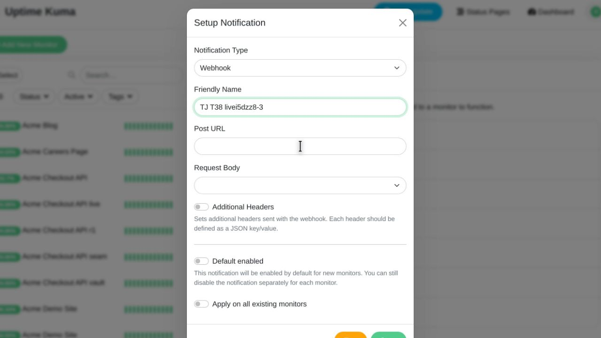
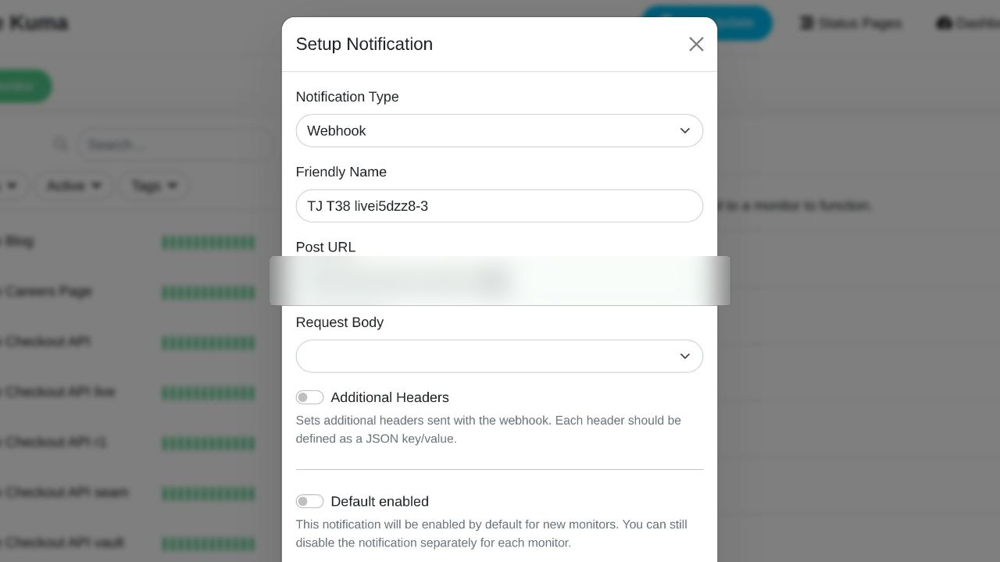
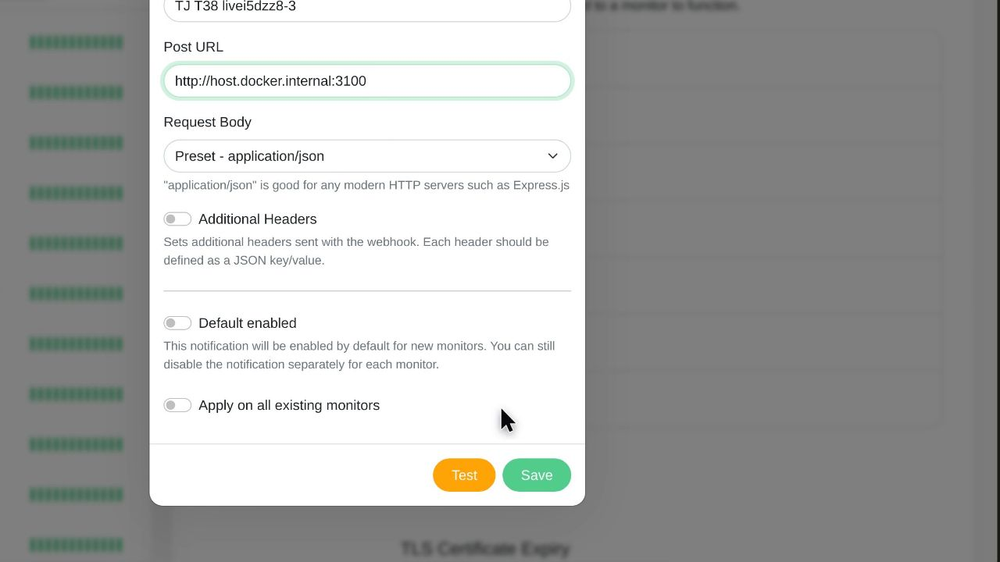
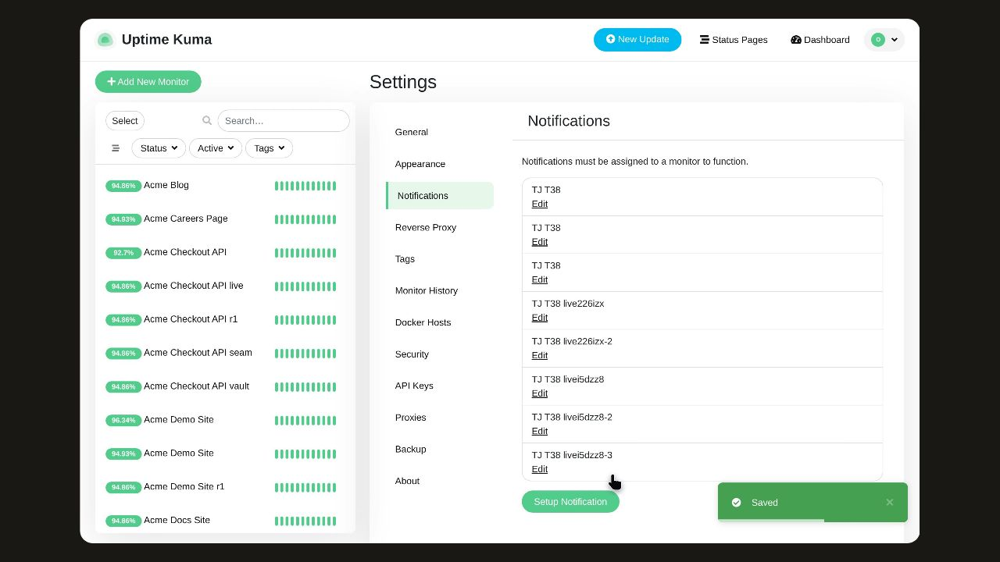

# Set up a notification

Add a webhook notification channel in Uptime Kuma so your monitors can post alerts to an endpoint you choose.

## Before you start

Open Settings and go to the Notifications tab at /settings/notifications, where notification channels for your monitors are listed.

## Step 1: Click Setup Notification to open the notification dialog.

## Step 2: In the notification type list, choose Webhook. The form switches to show the webhook fields.

## Step 3: In Friendly Name, enter a name for this notification channel. The recording uses "TJ T38 livei5dzz8-3", but you can use your own name.

## Step 4: In Post URL, enter the endpoint that should receive the webhook. The recording uses "http://host.docker.internal:3100"; enter your own endpoint URL.

## Step 5: In the request body list, choose Preset - application/json to send the ready-made JSON payload.

## Step 6: Click Save to store the webhook notification.

## Observed result

The recording does not show a confirmed result.

## About this page

Written from a completed recording. The instructions describe recorded actions and visible results.

## Related pages

Find your way around Uptime Kuma

Pause a Monitor in Uptime Kuma
