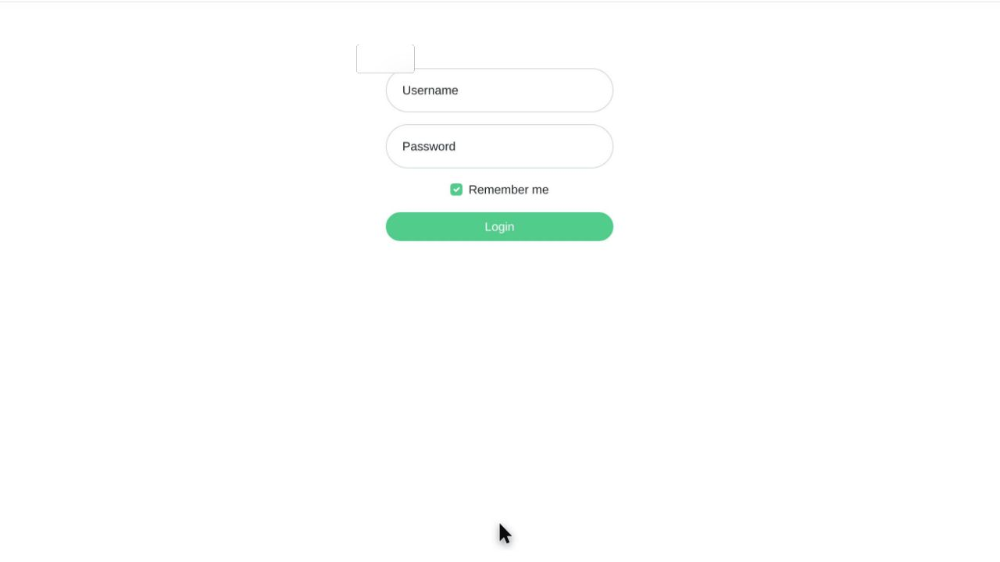
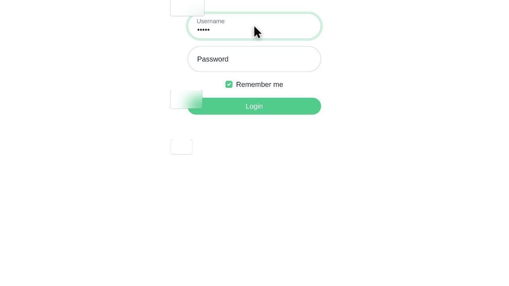
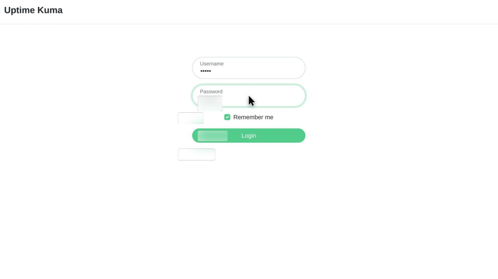
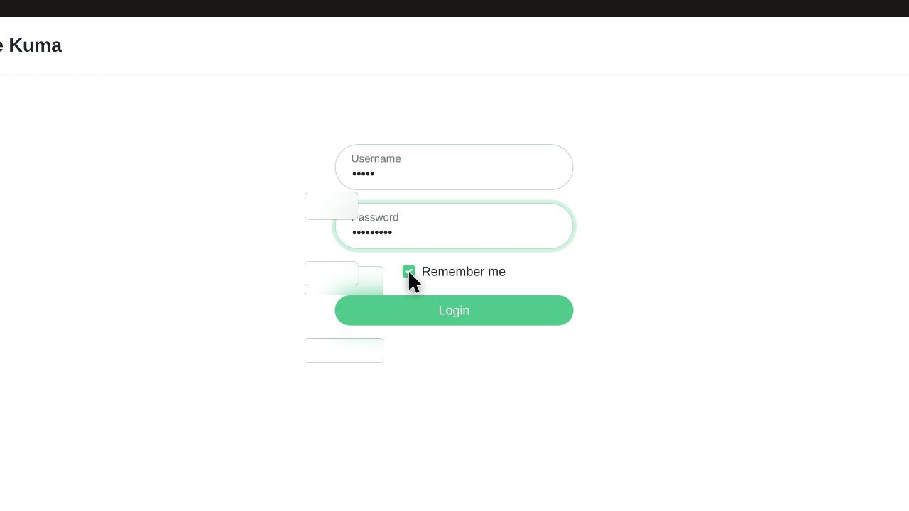
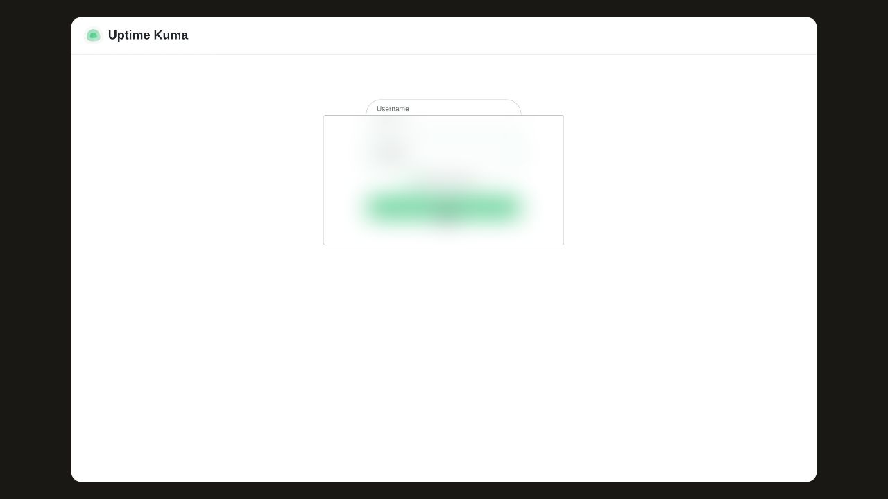

# Sign in

Sign in to the dashboard by entering your saved credentials and submitting the login form.

## Before you start

Open the login form at /dashboard.

## Step 1: Open /dashboard to display the login form.

## Step 2: Enter your saved username in the Username field.

## Step 3: Enter your password in the Password field, where it stays hidden on screen.

## Step 4: Confirm that Remember me stays selected.

## Step 5: Click Login to submit the form.

## Observed result

The dashboard shows Quick Stats, confirming that sign-in succeeded.

## About this page

Written from a completed recording. The instructions describe recorded actions and visible results.
