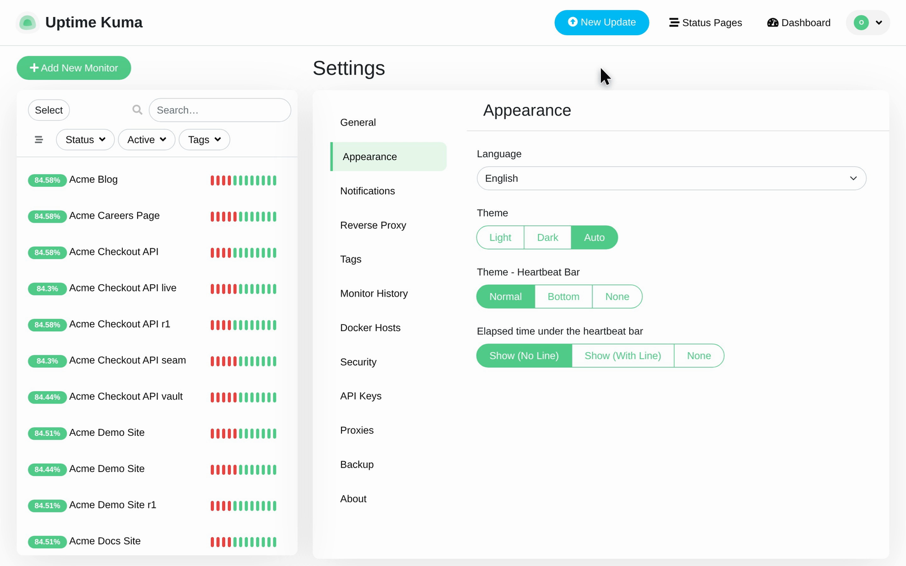
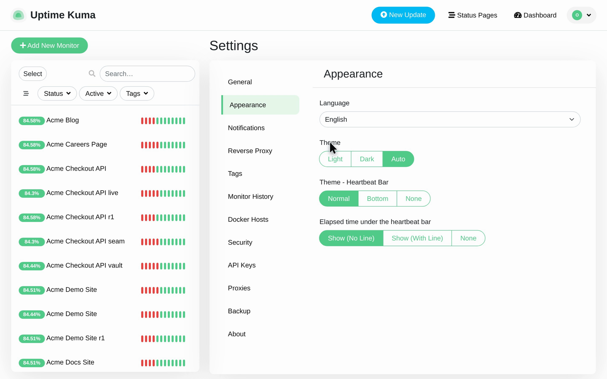
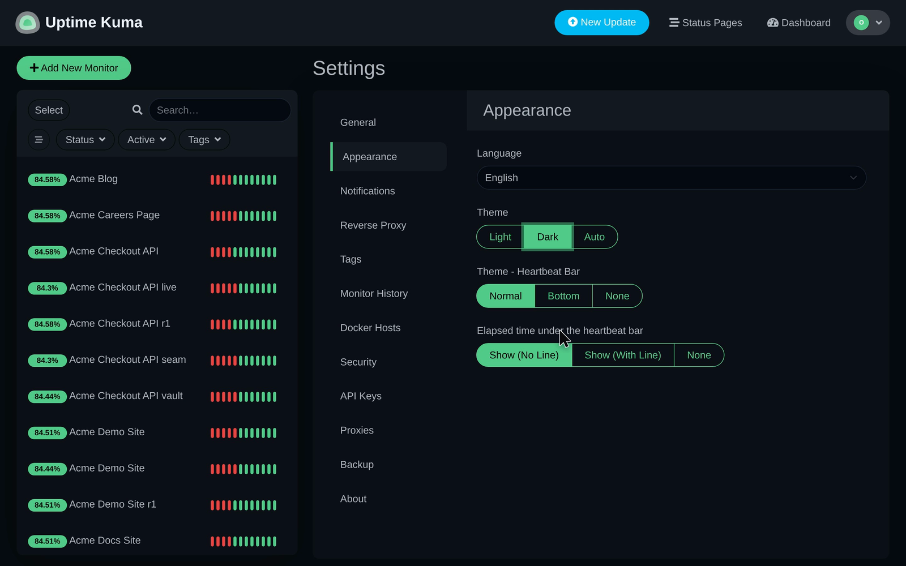
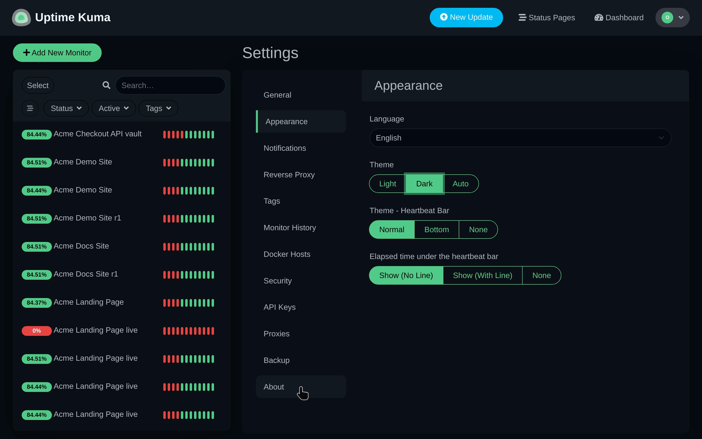

# Switch to dark theme

Follow the recorded steps for Switch to dark theme.

## Before you start

Start at /settings/appearance.

## Step 1: Look for Settings.

Look for Settings.

## Step 2: Look for Theme.

Look for Theme.

## Step 3: Click Dark.

Click Dark.

## Step 4: Look for Theme - Heartbeat Bar.

Look for Theme - Heartbeat Bar.

## Step 5: Scroll to About.

Scroll to About.

## Observed result

A result beyond the recorded actions has not been observed.

## About this page

Written from a completed recording. The instructions describe recorded actions and visible results.
