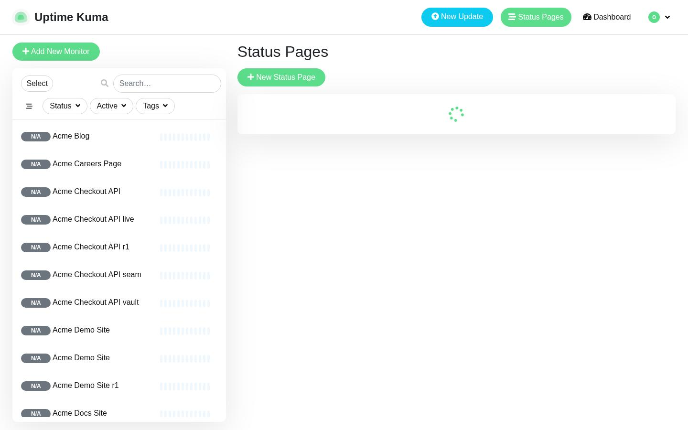

# Understand status pages

This page explains Understand status pages from the reviewed product map.

## Definition

Status pages let public visitors check the status of your services. Uptime Kuma supports multiple status pages, and different domains can point to different pages.

## Status Pages heading

Browse the Status Pages list and open a page uses Status Pages heading on Status Pages.

## page list rows

Browse the Status Pages list and open a page uses page list rows on Status Pages.

## /status/ addresses

Browse the Status Pages list and open a page uses /status/ addresses on Status Pages.

## New Status Page button

Browse the Status Pages list and open a page uses New Status Page button on Status Pages.

## About this page

Written from the reviewed product map.

## Related pages

Explore Status Page Details in Acme
